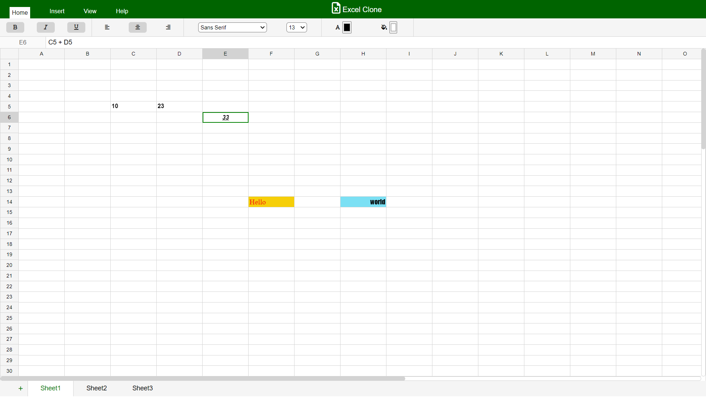

## Screenshots

* sheets data persists even if you toggle between multiple sheets.
## Features
1. **Formula Evaluation**                    
2. **Create Multiple Sheets**          
3. **Styling Options** 
* Bold
* Italic
* Underline
* choose between multiple font styles and font sizes
* change text color of a cell
* Fill color on a cell
3. **Text alignment in a cell**
* Left
* Center
* Right